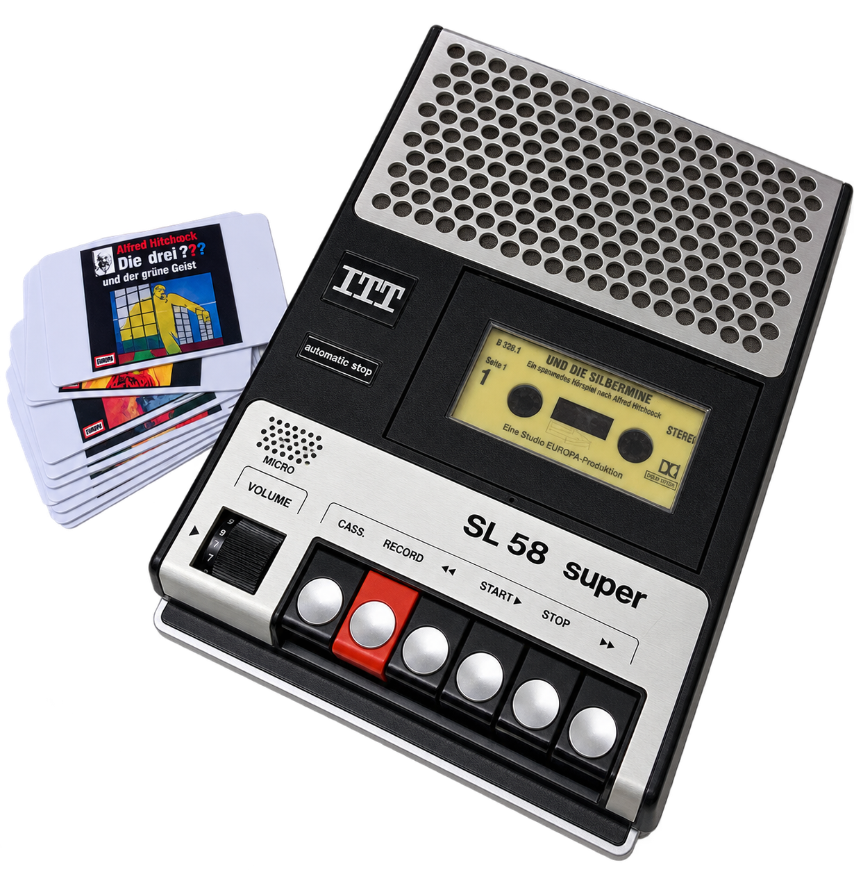
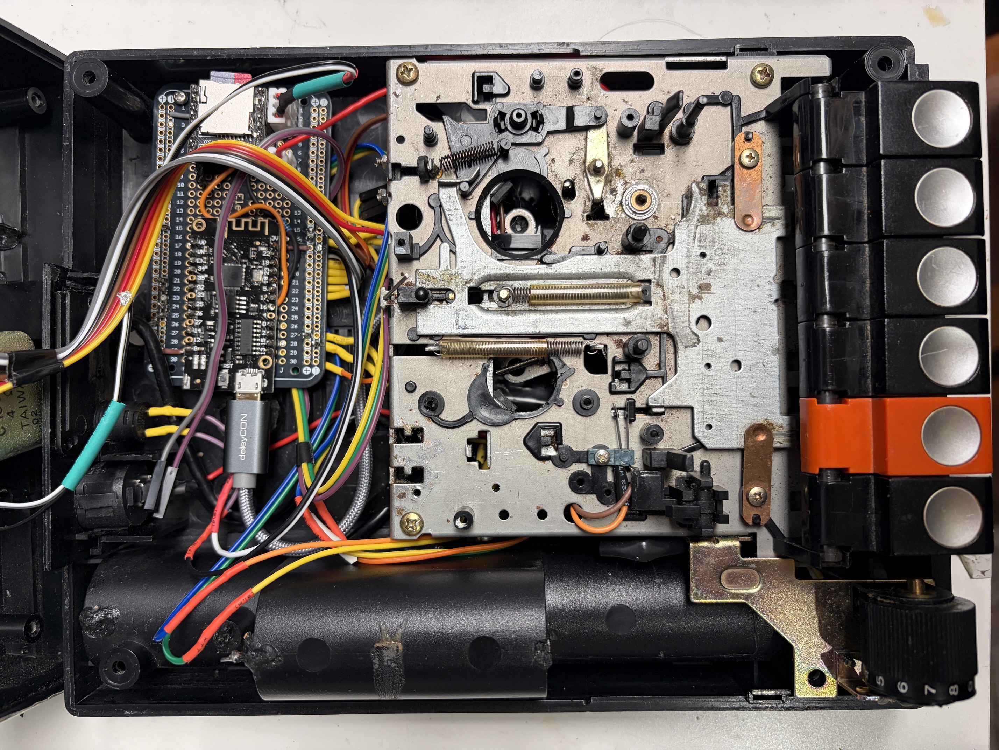
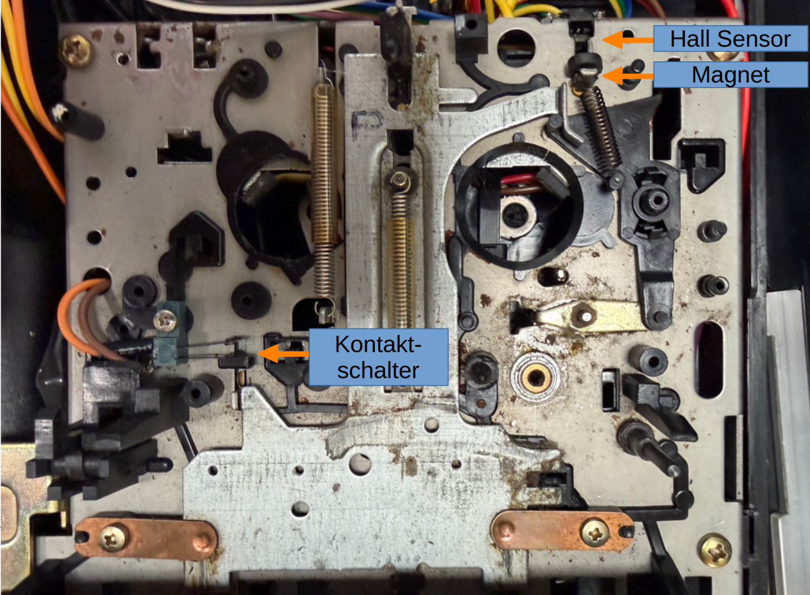

# 🎧 Höribert 3.0



> Ein moderner RFID-Hörspielplayer im Gehäuse eines klassischen **ITT SL59 Kassettenrecorders**.

Höribert 3.0 verbindet die Haptik eines alten Kassettenrecorders mit einem ESP32, RFID-Karten und einem DFPlayer Mini. Die ursprünglichen Bedienelemente des Recorders werden soweit möglich weiterverwendet – im Inneren arbeitet heute jedoch ein vollständig digitaler Audioplayer.

Der aktuelle Aufbau verwendet einen **Lolin32 Lite**, einen **DFPlayer Mini**, einen **RC522 RFID-Reader** und eine **18650-Zelle**. WLAN, Webdiagnose und OTA sind ausschließlich im bewusst gewählten Wartungsmodus aktiv.

Die Firmware und diese Dokumentation entstanden iterativ im „Vibe-Coding“-Stil
mit Unterstützung von **ChatGPT und OpenAI Codex**. Schaltung, Pinbelegung,
mechanischer Aufbau, Anforderungen und Tests am realen Gerät wurden dabei vom
Projektinhaber festgelegt und geprüft; KI-generierte Änderungen ersetzen keine
Erprobung an der konkreten Hardware.

## 📼 Idee und RFID-Hörspielkassette

Das Bedienkonzept soll sich weiterhin möglichst wie ein Kassettenrecorder aus den
1980er-Jahren anfühlen. Deshalb wird die RFID-Karte nicht lose auf den Reader
gelegt: Eine originale Hörspielkassette wurde ausgehöhlt, sodass eine RFID-Karte
in die Kassette eingeschoben werden kann.

Der Ablauf bleibt bewusst mechanisch:

```text
Hörspielkassette auswählen
→ RFID-Karte in die Kassette einschieben
→ Kassette in den ITT SL59 einlegen
→ PLAY drücken
→ Hörspiel startet
```

Der im Recorder montierte RC522 erkennt die Karte innerhalb der Kassette. Die
RFID-Erkennung allein startet noch keine Wiedergabe; dafür muss die originale
PLAY-Mechanik betätigt werden. So verbindet der Umbau moderne ESP32-/RFID-Technik
mit der ursprünglichen Haptik des Recorders.

## 🔧 Umbau des ITT SL59



*Gesamtansicht des geöffneten ITT SL59 nach dem Umbau.*

Um Platz für die neue Elektronik zu schaffen, wurden der originale Motor, das
originale Netzteil und die originale Verstärkerplatine entfernt. Der originale
Lautsprecher wird weiterverwendet und ist direkt zwischen den
DFPlayer-Ausgängen **SPK1 und SPK2** verbunden. SPK1 und SPK2 dürfen nicht gegen
GND verdrahtet werden.

Auch das originale Lautstärkepotentiometer bleibt erhalten. Der ESP32 wertet
dessen Stellung über GPIO34 aus und setzt sie in logische Lautstärkestufen um.

Im Batteriefach befindet sich ein von außen zugänglicher 18650-Li-Ion-Akku.
Akkuhalterung und Laderegler wurden unverändert aus einer kleinen Powerbank
übernommen. Der Akku wird über diese Ladeelektronik und eine auf der Rückseite
eingebaute Micro-USB-Buchse geladen. Diese externe Recorder-Buchse dient nur zum
Laden, nicht als Daten- oder Firmwareanschluss. Ebenfalls auf der Rückseite befinden sich
der Ein-/Ausschalter und der Multifunktionstaster GPIO25. Über unbekannte
Schutzfunktionen oder Ladeströme der übernommenen Elektronik werden keine
Annahmen getroffen.

## ⏯️ Originale Mechanik und Sensorik

Die originale mechanische Tastenmechanik wurde bewusst erhalten. START/STOP
verwendet den vorhandenen originalen Kontaktschalter, den der ESP32 direkt
auswertet. Für VORSPULEN und RÜCKSPULEN wurden kleine Magnete und Hall-Sensoren
ergänzt; die mechanischen Tasten selbst und damit ihr Bediengefühl bleiben
erhalten.

### Details des mechanischen Umbaus



Der originale Kontaktschalter der Recordermechanik dient weiterhin für
START/STOP. Die beiden Hall-Sensoren und kleinen Magnete erfassen VOR- und
RÜCKSPULEN berührungslos. Der kleine runde Magnetträger für die
Vorwärts-Erkennung stammt aus einem alten Kopfhörer und passte mechanisch sehr
gut in den vorhandenen Mechanismus.

---

## ✨ Funktionen

- 🎴 **RFID-gesteuerte Hörspielauswahl** über TonUINO-kompatible Karten
- 🔊 **DFPlayer Mini** als Audioplayer
- 🎚️ Nutzung des originalen Lautstärkereglers über den ESP32-ADC
- ▶️ Play/Pause über die Recorder-Bedienung
- ⏮️ / ⏭️ vorheriger und nächster Track
- ⏲️ Sleep-Timer in 10-Minuten-Schritten
- 💡 Status-LED zur Rückmeldung
- 💾 lokale Bookmark-Infrastruktur im ESP32-NVS
- 📡 optionaler Wartungsmodus mit WLAN und Browserdiagnose
- 🔄 OTA-Firmwareupdates nur im Wartungsmodus
- 🖥️ serielle Diagnose mit 115200 Baud
- 📟 Live-Logstream über TCP Port `2323`
- 🧪 separate Test-Firmwares für RFID, DFPlayer und GPIO-Funktionen

---

## 🧠 Wie Höribert funktioniert

Eine RFID-Karte enthält TonUINO-kompatible Metadaten. Höribert liest die Karte mit dem RC522 ein und verwendet die hinterlegte Ordnernummer zur Auswahl des entsprechenden Verzeichnisses auf der microSD-Karte des DFPlayers.

Aktuell wird bewusst nur **TonUINO Mode 2 (Album/Ordner)** abgespielt. Die Tracks eines Ordners werden dabei der Reihe nach wiedergegeben.

```text
RFID-Karte
    │
    ▼
RC522
    │
    ▼
Lolin32 Lite / ESP32
    │
    ├── Bedienelemente des ITT SL59
    ├── WLAN / OTA / Diagnose
    │
    ▼
DFPlayer Mini
    │
    ▼
Lautsprecher
```

---

## 🧰 Aktuelle Hardware

| Komponente | Verwendung |
|---|---|
| **ITT SL59** | Originalgehäuse und Bedienelemente |
| **Lolin32 Lite** | ESP32-Hauptcontroller |
| **DFPlayer Mini** | MP3-Wiedergabe von microSD |
| **RC522** | RFID/NFC-Leser |
| **18650 Li-Ion-Zelle** | mobile Stromversorgung |
| Lautstärkepotentiometer | originale Lautstärkeregelung |
| Hall-/Schaltsignale | Vor / Zurück / Play-Pause |
| Status-LED | optische Rückmeldung |

---

## 🔌 Pinbelegung der aktuellen Firmware

Die folgende Tabelle basiert auf dem **aktuellen Code** und ist damit maßgeblich für den derzeitigen Firmwarestand.

### RC522 RFID

| RC522 | Lolin32 Lite |
|---|---:|
| SDA / SS | GPIO 5 |
| RST | GPIO 22 |
| SCK | GPIO 18 |
| MISO | GPIO 19 |
| MOSI | GPIO 23 |
| 3.3 V | 3V3 |
| GND | GND |

### DFPlayer Mini

| DFPlayer | Lolin32 Lite |
|---|---:|
| TX | GPIO 16 |
| RX | GPIO 17 |
| VCC | Versorgung |
| GND | GND |

Für die Verbindung **ESP32 TX → DFPlayer RX** wird im Aufbau ein Serienwiderstand verwendet.

### Bedienelemente

| Funktion | GPIO | Verhalten |
|---|---:|---|
| Lautstärke | GPIO 34 | ADC, 0–10 logische Lautstärkestufen |
| Play/Pause | GPIO 26 | aktiv gegen GND |
| Vor | GPIO 14 | nächster Track |
| Zurück | GPIO 13 | vorheriger Track |
| Sleep-Timer / Wartungswahl | GPIO 25 | beim Boot LOW: Wartungsmodus; danach kurzer / langer Tastendruck |
| Status-LED | GPIO 32 | kurze optische Rückmeldung |

Alle produktiven Pins sind zentral in `src/hardware/HardwarePins.h` definiert.

---

## 🎴 RFID / TonUINO-Kompatibilität

Der RFID-Code erkennt aktuell:

- MIFARE Classic 1K
- MIFARE Classic 4K
- MIFARE Ultralight / kompatible Tags

TonUINO-Karten werden anhand des Magic Cookies

```text
13 37 B3 47
```

erkannt. Ausgelesen werden unter anderem:

```text
Version
Folder
Mode
Special
Special2
```

Für MIFARE Classic wird der TonUINO-Datenblock mit dem Standard-Key `FF FF FF FF FF FF` gelesen.

### Aktuelle Einschränkung

Die NormalMode-Logik unterstützt momentan nur:

```text
Mode 2 = Album / Ordner
```

Andere TonUINO-Modi werden erkannt, aber derzeit nicht abgespielt.

### RFID-Karten vorbereiten

Höribert ist ausschließlich ein **Kartenleser**. Die Firmware besitzt keinen
Schreib- oder Administrationsmodus. Karten müssen vorher mit einem
TonUINO-kompatiblen Kartenwerkzeug oder mit der Kartenkonfiguration eines
originalen TonUINO vorbereitet werden. Die fertige Karte wird anschließend in
die ausgehöhlte Hörspielkassette eingeschoben.

Das von Höribert gelesene Datenformat liegt bei MIFARE Classic in Block 4. Bei
unterstützten Ultralight-Tags sucht die Firmware ab Seite 4 nach dem Cookie
(TonUINO-TNG legt die Nutzdaten üblicherweise ab Seite 8 ab):

| Byte | Inhalt | Von Höribert verwendet |
|---:|---|---|
| 0–3 | Magic Cookie `13 37 B3 47` | Prüfung der Kompatibilität |
| 4 | Formatversion | Diagnose |
| 5 | Ordner `1`–`99` | Auswahl des SD-Ordners |
| 6 | Modus | derzeit muss dies `2` sein |
| 7 | Special | wird gelesen, derzeit nicht ausgewertet |
| 8 | Special 2 | wird gelesen, derzeit nicht ausgewertet |

MIFARE-Classic-Karten werden mit dem üblichen Default-Key
`FF FF FF FF FF FF` authentifiziert. Karten mit abweichenden Schlüsseln kann
Höribert nicht lesen. Vor dem Einbau in eine Kassette sollte jede Karte mit der
RFID-Diagnosefirmware geprüft werden.

---

## 🎵 microSD-Karte vorbereiten

Eine microSD-Karte mit **FAT16 oder FAT32 und höchstens 32 GB** verwenden. Für
einen reproduzierbaren Aufbau die Karte frisch formatieren und Ordner sowie
Dateien sauber nummeriert kopieren. Der DFPlayer arbeitet mit Ordnern `01` bis
`99` und Dateien `001.mp3` bis `255.mp3`; eine RFID-Karte verweist mit Byte 5
auf die entsprechende Ordnernummer.

Beispiel:

```text
/01/001.mp3
/01/002.mp3
/01/003.mp3

/02/001.mp3
/02/002.mp3
...

/35/001.mp3
/35/002.mp3
```

Die Firmware enthält aktuell Namen für die Hörspielordner `1` bis `99` und zeigt
diese in Diagnoseausgaben entsprechend an. Die DFRobot-Dokumentation garantiert
keine bestimmte Kopierreihenfolge. Bei unerwarteter Wiedergabereihenfolge die
Karte deshalb frisch formatieren und die sauber nummerierten Dateien in der
gewünschten Reihenfolge neu kopieren.

### RC522: Aufbau und Fehlersuche

- Den RC522 ausschließlich mit **3,3 V** betreiben; `IRQ` bleibt unbeschaltet.
- Leitungen kurz, sauber und mit gemeinsamer Masse führen. Der Leseabstand ist
  klein; Karte und Antenne möglichst nahe und parallel zueinander platzieren.
- Die Qualität verschiedener RC522-Platinen und Karten schwankt. Bei instabiler
  Erkennung zunächst Versorgung, Kontakte, Leitungsführung und Abstand prüfen.
- Ein Versionsregister wie `0x92` ist bei einem MFRC522 plausibel. `0x00` oder
  `0xFF` deutet typischerweise auf Versorgung-, Verdrahtungs- oder SPI-Probleme.
- `platformio.ini` setzt `MFRC522_SPICLOCK=1000000` und reduziert den SPI-Takt
  damit bewusst auf 1 MHz. Das erhöht bei der realen Verdrahtung die Robustheit.

---

## 🎚️ Lautstärke

Das originale Potentiometer wird über **GPIO 34** eingelesen. Die Firmware filtert und stabilisiert den ADC-Wert, um Sprünge und Störungen des alten Potentiometers zu reduzieren.

Nach außen arbeitet Höribert mit Lautstärkestufen von:

```text
0 … 10
```

Diese werden intern auf den DFPlayer-Bereich bis maximal `24` umgesetzt.

---

## ⏲️ Sleep-Timer

Der Taster an **GPIO 25** steuert den Sleep-Timer:

- **kurzer Tastendruck:** +10 Minuten
- **weiterer kurzer Druck:** nochmals +10 Minuten
- **langer Tastendruck ab ca. 1,2 s:** Timer löschen

Nach Ablauf wird die aktuelle Position gespeichert. Anschließend werden DFPlayer,
RC522, WLAN und Wartungsdienste soweit softwareseitig möglich heruntergefahren und
der ESP32 wechselt in Deep Sleep.

Deep Sleep wird außerdem ausgelöst, wenn ein Hörspielordner vollständig beendet
ist oder zehn Minuten lang keine Wiedergabe aktiv war. Das umfasst den Leerlauf
ohne Karte, das Warten auf PLAY nach erkannter Karte und eine zehn Minuten lang
nicht fortgesetzte Pause. Aktive Wiedergabe sowie relevante Bedien- und
Playback-Aktionen setzen die Inaktivitätszeit zurück. Bei einem vollständig
beendeten Ordner wird dessen Bookmark vor dem Schlafen gelöscht.

Zum Aufwecken GPIO25 kurz drücken. Ein EXT0-Wakeup über GPIO25 startet immer den
normalen Playerbetrieb mit ausgeschaltetem WLAN und wird nicht als Wartungsstart
gewertet. Nur wenn GPIO25 bei einem Kaltstart oder normalen Reset gedrückt ist,
wird der Wartungsmodus gewählt. Der Wakeup-Tastendruck wird bis zum ersten
Loslassen von der Sleep-Timer-Logik ignoriert.

Nach dem Aufwecken startet keine Wiedergabe automatisch: Karte und PLAY sind
weiterhin erforderlich. Hauptschalter AUS/EIN ist ein normaler Kaltstart.

Vor Deep Sleep sendet die Firmware dem DFPlayer den Sleep-Befehl und versetzt den
RC522 mit ausgeschalteter Antenne in SoftPowerDown. Ohne schaltbare
Versorgungsleitungen bleiben beide Module dennoch elektrisch am Akku. Auch
Spannungsregler, Ladeelektronik und LEDs des LOLIN32-Lite können weiterhin Strom
verbrauchen; ESP32-Deep-Sleep allein garantiert daher keinen minimalen
Gesamtruhestrom des Geräts.

---

## 💾 Bookmark-Status

Im Code existiert bereits eine lokale Bookmark-Infrastruktur auf Basis der ESP32-`Preferences`.

Positionen werden unter anderem beim

- Pausieren,
- Kartenwechsel und
- Ablaufen des Sleep-Timers

gespeichert.

Beim erneuten Erkennen derselben Karte lädt die Firmware den Bookmark für UID und
Ordner. Die Wiedergabe beginnt am Anfang des gespeicherten Tracks. Die ebenfalls
gespeicherten Sekunden dienen nur als Diagnosewert; ein unzuverlässiges Seeking
innerhalb einer MP3-Datei wird bewusst nicht versucht. Nach vollständig
abgespieltem Ordner wird der Bookmark gelöscht.

---

## 📡 WLAN, OTA und Live-Diagnose

Im normalen Betrieb bleibt das ESP32-WLAN vollständig ausgeschaltet. Dadurch gibt es
keine WLAN-Wartezeit und RFID, DFPlayer und Bedienelemente starten direkt.

Für den Wartungsmodus den hinteren Taster **GPIO25 beim Einschalten oder Reset
gedrückt halten**. GPIO25 ist mit `INPUT_PULLUP` beschaltet und bei gedrücktem
Taster LOW. Der beim Boot erkannte Modus bleibt bis zum nächsten Neustart aktiv.
Nach dem ersten Loslassen arbeitet derselbe Taster wieder normal als Sleep-Timer;
der Boot-Tastendruck löst keine Timeraktion aus.

Im Wartungsmodus verbindet sich Höribert nicht blockierend mit dem konfigurierten
WLAN. Ist das WLAN nicht erreichbar, läuft der Player ohne Web/OTA weiter.

### OTA

ArduinoOTA wird im Wartungsmodus gestartet, sobald die WLAN-Verbindung hergestellt
wurde. Der bewusst beibehaltene Standardhostname aus `secrets.example.h` ist
`itt-sl58`, entsprechend ist das OTA-Ziel `itt-sl58.local`. Die Bezeichnung ist
ein absichtlicher Hostname und ändert nichts daran, dass das Gerät ein ITT SL59 ist.

Die PlatformIO-Konfiguration enthält sowohl USB- als auch OTA-Umgebungen.

### Live-Log

Zusätzlich zum USB-Serial-Monitor kann die laufende Firmware über TCP beobachtet werden:

```bash
nc <IP-DES-HOERIBERT> 2323
```

Bis zu zwei Log-Clients können gleichzeitig verbunden sein.

### Webinterface

Die technische Statusseite ist im Wartungsmodus unter
`http://itt-sl58.local/` beziehungsweise unter der im seriellen Log gemeldeten
IP-Adresse erreichbar. Sie zeigt System-, WLAN-, RFID-, DFPlayer-, Player- und
GPIO-Zustände sowie die letzten 100 Diagnosezeilen. Die Anzeige aktualisiert sich
alle 1,5 Sekunden. Im Normalbetrieb laufen weder HTTP-Server noch OTA oder
TCP-Logserver.

Webseite, TCP-Log und OTA besitzen keine eigene Anmeldung. Den Wartungsmodus
daher nur in einem vertrauenswürdigen lokalen Netz verwenden und nach der
Wartung normal neu starten. Im Normalmodus sind diese Netzwerkdienste aus.

---

## 🏗️ Software-Architektur

Der produktive Einstiegspunkt ist bewusst sehr klein:

```text
src/main.cpp
    │
    ▼
App
    │
    ▼
NormalMode
    │
    ├── RFIDManager
    ├── AudioPlayer
    └── WebServerManager
```

Wichtige Dateien:

```text
src/
├── main.cpp
├── App.cpp
├── App.h
│
├── modes/
│   ├── NormalMode.cpp
│   └── NormalMode.h
│
└── hardware/
    ├── AudioPlayer.cpp
    ├── AudioPlayer.h
    ├── RFIDManager.cpp
    ├── RFIDManager.h
    ├── WebServerManager.cpp
    ├── WebServerManager.h
    ├── PowerManager.cpp
    ├── PowerManager.h
    └── HardwarePins.h
```

Hardwaretests liegen als separate Build-Ziele vor und werden nicht in die
produktive Firmware gelinkt.

---

## 🧪 Test-Firmwares

Das Repository enthält zusätzliche Standalone-Firmwares zur Fehlersuche:

| PlatformIO Environment | Zweck |
|---|---|
| `esp32dev_usb` | normale Firmware per USB |
| `esp32dev_ota` | normale Firmware per OTA |
| `dumpinfo_usb` | RFID-/Tag-Diagnose |
| `dfplayer_test_usb` | DFPlayer-Test |
| `dfplayer_test_ota` | DFPlayer-Test per OTA |
| `gpio_function_test_usb` | GPIO-/Bedienelementetest |
| `gpio_function_test_ota` | GPIO-Test per OTA |

Das Standardziel ist aktuell:

```ini
default_envs = esp32dev_ota
```

### Diagnose bauen und starten

```bash
# RC522, Kartentyp, UID und Rohdaten prüfen
pio run -e dumpinfo_usb -t upload

# DFPlayer, Lautstärke und Wiedergabe isoliert prüfen
pio run -e dfplayer_test_usb -t upload

# Taster, Hall-Sensoren, Poti, LED und RC522 prüfen
pio run -e gpio_function_test_usb -t upload

# Danach serielle Ausgabe öffnen
pio device monitor --baud 115200

# Normale Firmware per USB
pio run -e esp32dev_usb -t upload

# Normale Firmware per OTA (Gerät zuvor im Wartungsmodus starten)
pio run -e esp32dev_ota -t upload
```

Vor dem Flashen der normalen Firmware sind mindestens Reader-Version,
TonUINO-Cookie, Ordner/Modus, DFPlayer-Kommunikation und alle GPIO-Zustände zu
kontrollieren. Beim getesteten Reader erscheint beispielsweise `RC522=0x92`;
bei einer Karte folgen UID, SAK, Kartentyp und gegebenenfalls der gefundene
TonUINO-Cookie. Die Testfirmware `dfplayer_test_usb` verwendet für einige ihrer
eigenen Testtaster absichtlich eine abweichende Laborbelegung; die produktive
Belegung steht oben in der Pin-Tabelle.

Für die Browserdiagnose GPIO25 beim Kaltstart gedrückt halten. Danach stehen im
Wartungsnetz `http://itt-sl58.local/`, Status, Live-Log und OTA bereit.

---

## 🚀 Build mit PlatformIO

Voraussetzungen:

- VS Code + PlatformIO oder PlatformIO Core
- USB-Verbindung für den ersten Flash
- anschließend optional OTA

Repository klonen:

```bash
git clone https://github.com/toor0001/hoeribert_3.0.git
cd hoeribert_3.0
```

Normale Firmware über USB bauen und hochladen:

```bash
pio run -e esp32dev_usb -t upload
```

Serial Monitor:

```bash
pio device monitor -b 115200
```

OTA-Build:

```bash
pio run -e esp32dev_ota -t upload
```

> [!NOTE]
> Das in `platformio.ini` eingetragene OTA-Ziel ist `itt-sl58.local`. Vor einem
> OTA-Upload muss Höribert durch gedrücktes GPIO25 im Wartungsmodus gestartet sein.

---

## 🔐 WLAN-Konfiguration

Die echten Zugangsdaten gehören **nicht** ins Repository.

Vorlage kopieren:

```bash
cp include/secrets.example.h include/secrets.h
```

Danach anpassen:

```cpp
#pragma once

constexpr const char* WIFI_SSID = "dein-wlan-name";
constexpr const char* WIFI_PASS = "dein-wlan-passwort";
constexpr const char* OTA_NAME = "itt-sl58";
constexpr const char* DEVICE_NAME = "Hoeribert 3.0";
```

`include/secrets.h` ist über `.gitignore` ausgeschlossen.

---

## 📦 Abhängigkeiten

Die benötigten Bibliotheken werden von PlatformIO automatisch installiert:

- `miguelbalboa/MFRC522`
- `dfrobot/DFRobotDFPlayerMini`

Framework:

```text
Arduino on ESP32
```

Board-Konfiguration:

```text
lolin32_lite
```

---

## 🚧 Aktueller Projektstatus

Höribert 3.0 ist ein aktiv weiterentwickeltes DIY-Projekt.

### Funktioniert bereits

- ESP32 / Lolin32 Lite als Hauptcontroller
- DFPlayer-Wiedergabe
- RFID-Erkennung und TonUINO-Dekodierung
- Album-Wiedergabe aus RFID-Ordnern
- Play/Pause
- Vor / Zurück
- Lautstärkepoti
- Sleep-Timer
- Status-LED
- lokale Bookmark-Speicherung
- Wartungsmodus mit WLAN, Webdiagnose und OTA
- TCP-Live-Logs
- USB-/OTA-Testfirmwares

### Noch in Arbeit / vorbereitet

- weitere TonUINO-Modi
- optionaler Hardwaretest mit einem **2,2-Ohm-Leistungswiderstand in Reihe zum
  Lautsprecher**, falls die Gesamtlautstärke später noch reduziert werden soll;
  der Lautsprecher bleibt dabei zwischen DFPlayer **SPK1 und SPK2**, beide
  Anschlüsse dürfen nicht gegen GND verdrahtet werden

---

## 🧬 Vorgängerprojekt Höribert 2.0

[Höribert 2.0](https://github.com/toor0001/Hoeribert-2.0) ist der direkte
Software-Vorgänger dieses Projekts. Höribert 3.0 wurde für den aktuellen
Lolin32-Lite-/RC522-/DFPlayer-Aufbau, die originale SL59-Mechanik und den
Wartungsmodus weiterentwickelt; der Vorgänger nutzt ein anderes Gehäuse und
einen anderen Hardwarestand. Die Projekte sind daher kein 1:1-Port und ihre
Pinbelegungen nicht austauschbar. Einzelne bewährte Softwarelösungen wurden
übernommen und weiterentwickelt. Insbesondere behandelt 3.0 doppelte
DFPlayer-`PlayFinished`-Meldungen explizit, damit ein einzelnes Titelende nicht
mehr zum Überspringen des folgenden Titels führt.

## 🙏 Credits, Inspiration und Kompatibilität

Das RFID-Hörspielkonzept und das Kartenformat wurden durch das
[TonUINO-Projekt](https://tonuino.de/) von **Thorsten Voß** inspiriert. Nützliche
Referenzen sind die [aktuelle TonUINO-TNG-Firmware](https://github.com/tonuino/TonUINO-TNG)
und das [historische TonUINO-Repository](https://github.com/xfjx/TonUINO).
Höribert ist ein unabhängiges DIY-Projekt, keine offizielle TonUINO-Firmware und
derzeit nur mit Kartenmodus 2 kompatibel.

Wesentliche externe Software:

- [Höribert 2.0](https://github.com/toor0001/Hoeribert-2.0) als direkter
  Software-Vorgänger
- [Arduino-ESP32](https://github.com/espressif/arduino-esp32) als Framework
- [miguelbalboa/rfid](https://github.com/miguelbalboa/rfid) für den MFRC522
  (Unlicense/Public Domain)
- [DFRobotDFPlayerMini](https://github.com/DFRobot/DFRobotDFPlayerMini) für den
  DFPlayer Mini (GNU LGPL)

Der eigene Höribert-Quellcode steht unter der MIT-Lizenz in `LICENSE`.

---

## ❤️ Idee hinter dem Projekt

Höribert soll sich nicht wie ein ESP32-Projekt in einer Plastikbox anfühlen.

Die Idee ist, einen echten alten Kassettenrecorder weiterleben zu lassen: Die großen mechanischen Tasten, der Lautstärkeregler und das massive Gehäuse bleiben Teil des Erlebnisses – nur Kassette und Tonkopf werden durch RFID und digitale Audiodateien ersetzt.

**Vintage außen. ESP32 innen. Hörspiele wie früher – nur komfortabler.**
